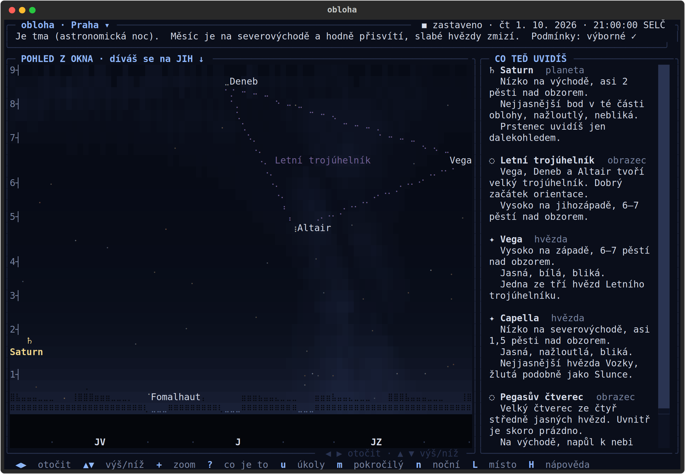
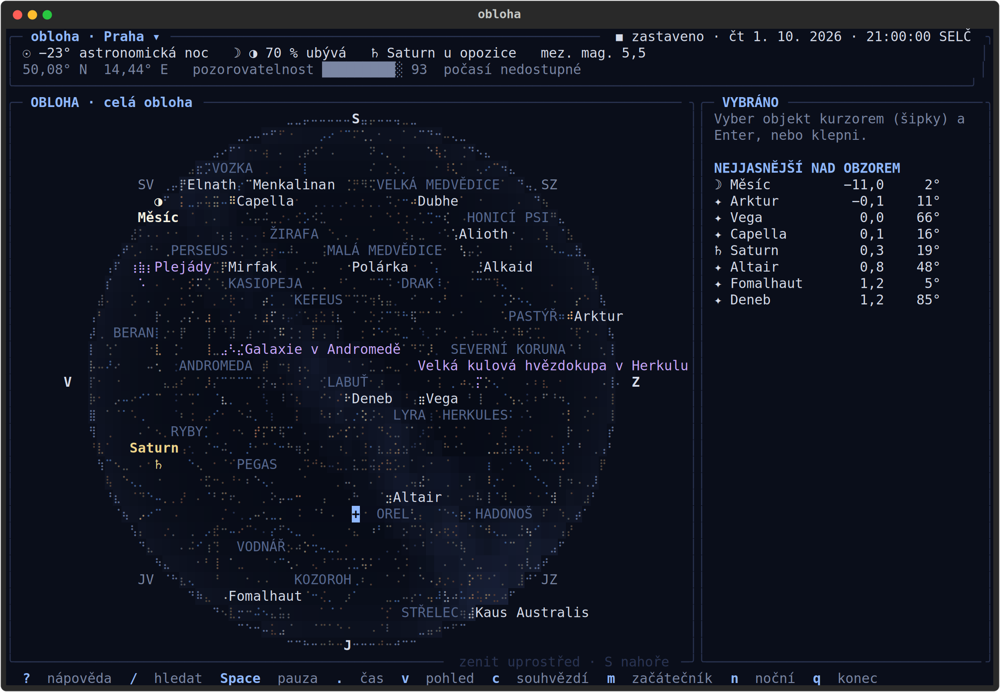
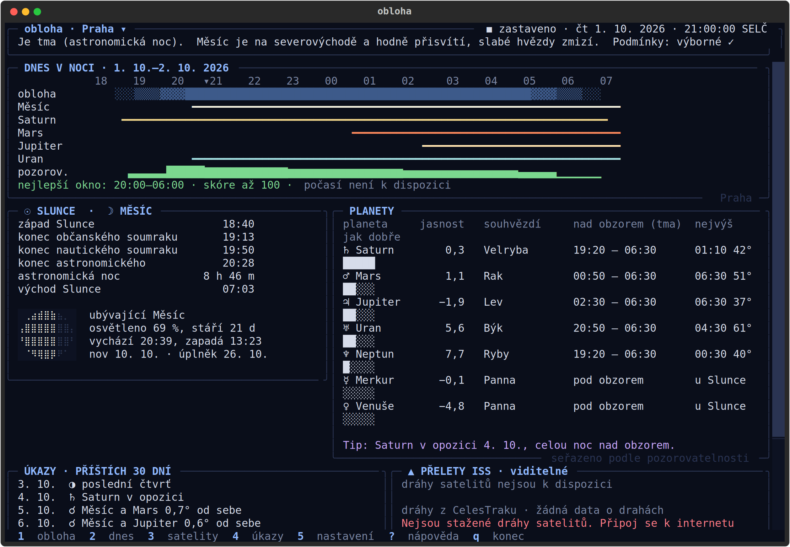
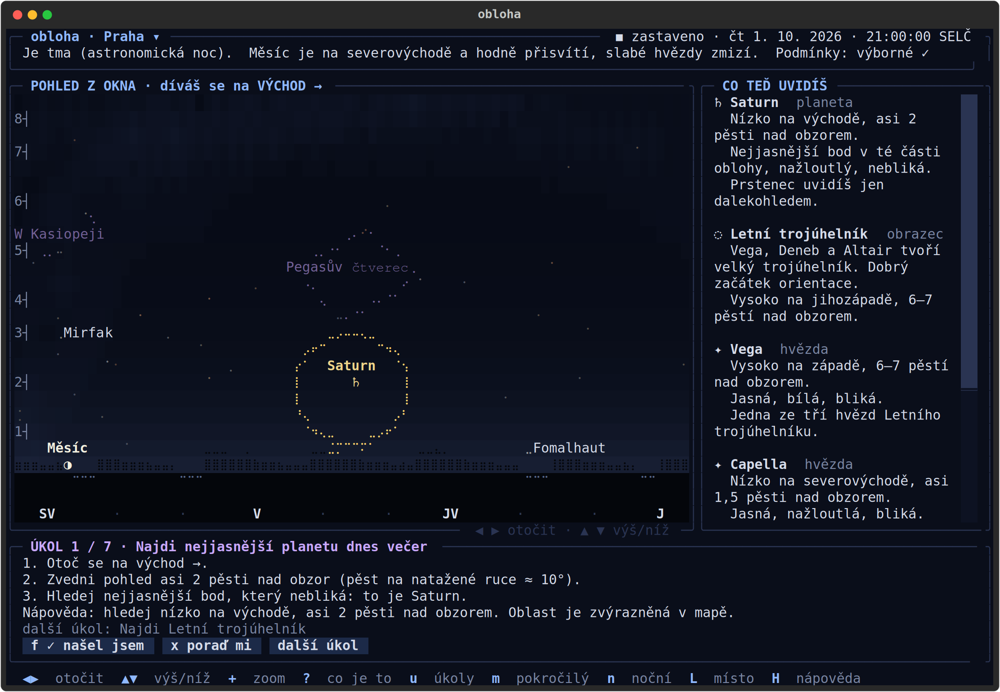
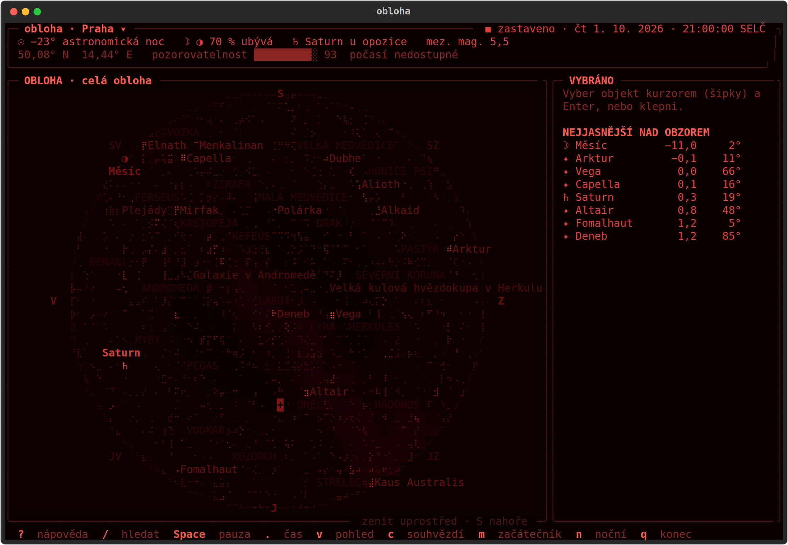
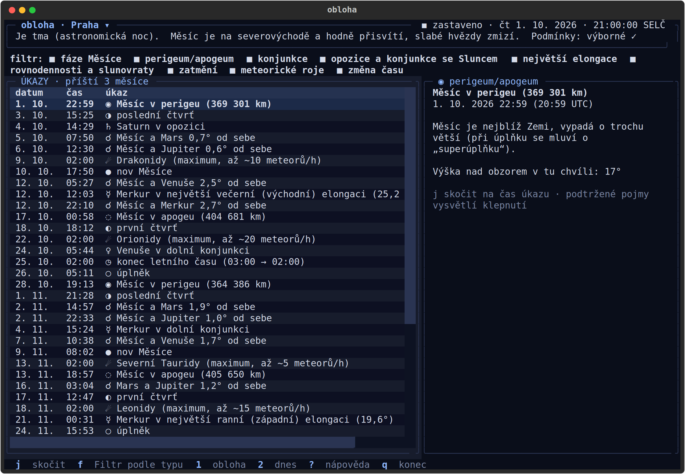
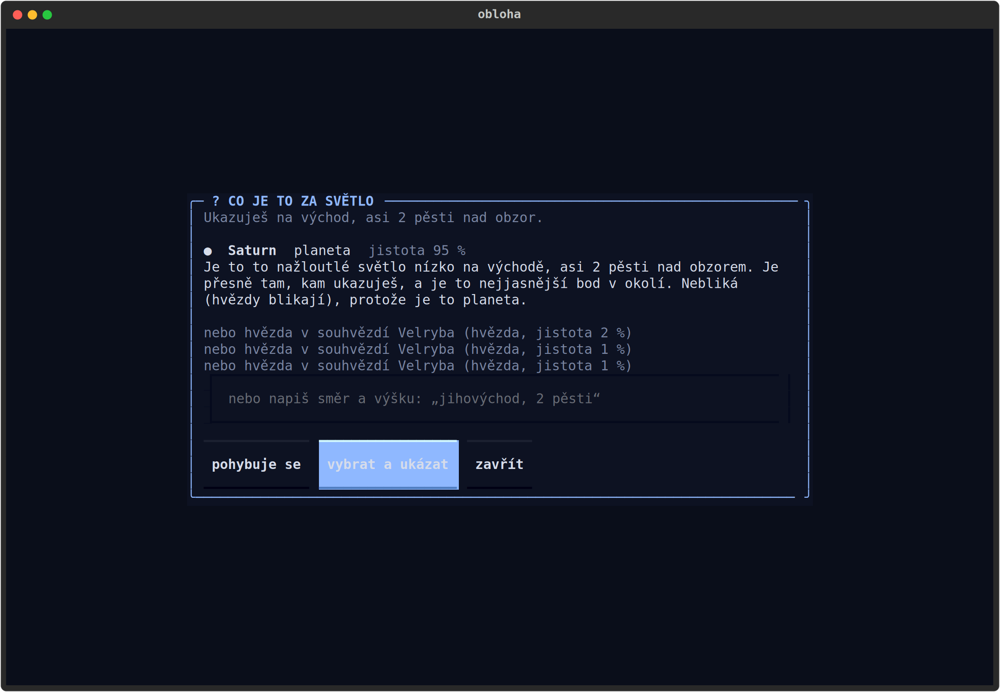
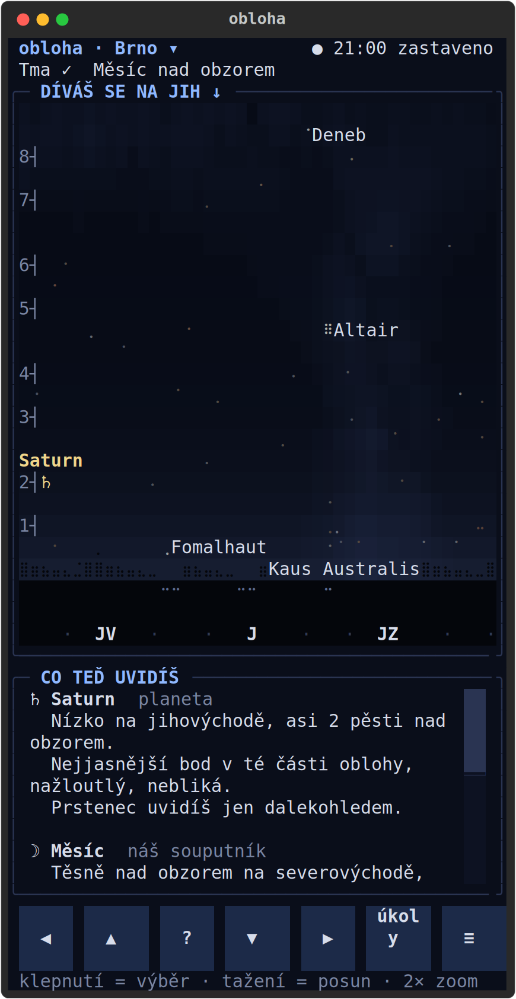
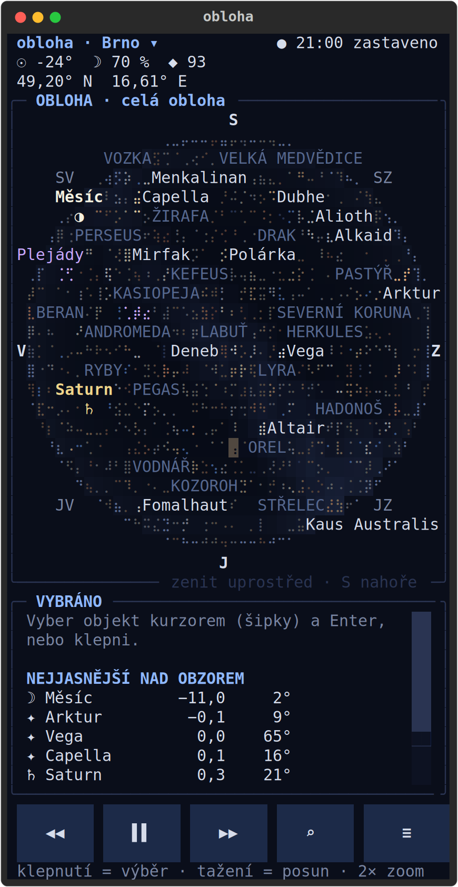
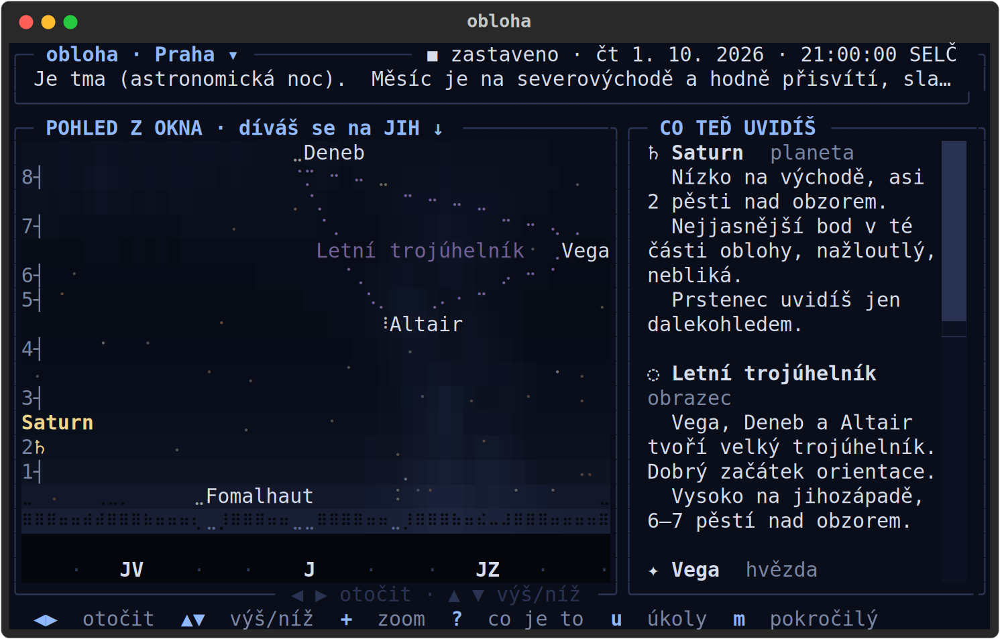

# obloha – terminálové planetárium

`obloha` ukáže v terminálu, co je **právě teď (nebo kdykoli jindy) na obloze** nad
zvoleným místem: hvězdy, souhvězdí, planety, Měsíc, Slunce a satelity. K tomu přehled
úkazů (zatmění, konjunkce, roje meteorů…) a odpověď na otázku **„dá se dnes pozorovat?“**.

Je udělaná i pro člověka, který se v obloze **vůbec nevyzná**: výchozí je pohled z okna
s horizontem dole, popisy „nízko na jihovýchodě, asi 2 pěsti nad obzorem“, panel
„Co teď uvidíš“, otázka „Co je to za světlo?“ a úkoly s průvodcem.

Funguje **úplně offline** (efemeridy, katalog hvězd i 40 tisíc měst jsou součástí
balíčku). Síť je potřeba jen pro aktualizaci drah satelitů a předpověď oblačnosti.



| | |
|---|---|
|  |  |
|  |  |
|  |  |

<p>



</p>

Screenshoty jsou vygenerované skriptem `scripts/screenshots.py` pro pevný čas
1. 10. 2026 21:00 SELČ (Praha, mobilní pohled Brno).

## Co umí

- **Začátečnický režim (výchozí):** pohled z okna na zvolenou světovou stranu se
  siluetou střech, výška v pěstech na natažené ruce, směry slovy, barva a jasnost slovy,
  pomocné obrazce (Letní trojúhelník, Velký vůz, W Kasiopeji, Pegasův čtverec…),
  „Co teď uvidíš“, „Co je to za světlo?“ (klepni nebo napiš „jihovýchod, 2 pěsti“),
  **úkoly s průvodcem** vybírané podle toho, co je právě vidět, a **slovníček** pojmů.
- **Pokročilá mapa (`m`):** celá obloha (zenit uprostřed, sever nahoře, východ vlevo)
  nebo pohled jedním směrem, braille ve vysokém rozlišení, barvy hvězd podle B−V,
  vrstvy (čáry a hranice souhvězdí, Mléčná dráha, síť alt-az/RA-Dec, ekliptika,
  popisky), kurzor a informační panel (výška, azimut, RA/Dec, východ/kulminace/západ).
- **Dnes v noci (`2`):** soumraky, délka astronomické noci, fáze Měsíce jako braille
  disk, planety seřazené podle pozorovatelnosti, časová osa noci a skóre 0–100.
- **Satelity (`3`):** ISS, Tiangong, Hubble (volitelně Starlink), přelety na 7 dní
  s viditelností a odhadem jasnosti. Stáří drah je vždy vidět.
- **Úkazy (`4`):** fáze Měsíce, perigeum/apogeum, konjunkce, opozice, elongace,
  rovnodennosti a slunovraty, **zatmění Slunce a Měsíce viditelná z místa**, meteorické
  roje s odhadem rušení Měsícem, změny času. `j` skočí na čas úkazu.
- **Místo podle města:** všech 6 259 obcí ČR, sídla SR a města světa nad 15 000
  obyvatel, hledání bez diakritiky i s překlepy, oblíbená a poslední místa,
  **porovnání měst**, ruční souřadnice.
- **Časové cestování:** živě, pauza, kroky, zrychlení ×10/×100/×1000 i zpět, zadání
  data a času (1900–2049).
- **Noční vidění (`n`):** všechno v odstínech červené.
- **Mobil, tablet, tmux:** responzivní rozložení, dotyk (klepnutí, tažení, dvojklepnutí),
  kompas telefonu přes Termux:API, 256 barev, bezpečný režim znaků `--ascii`,
  prohlížeč přes `obloha --web`.

## Instalace

```sh
uv tool install obloha            # nebo: pipx install obloha
uv tool install 'obloha[all]'     # + timezonefinder a textual-serve (--web)
```

Ze zdrojů:

```sh
git clone https://github.com/luquas95/obloha && cd obloha
uv sync && uv run obloha
```

**Arch Linux:** `packaging/aur/PKGBUILD` (`makepkg -si`).

### Termux (Android)

Binární balíčky je v Termuxu lepší instalovat přes `pkg`, z PyPI by se překládaly:

```sh
pkg update
pkg install python python-numpy rust     # rust jen kvůli pydantic-core
pip install obloha                        # timezonefinder je volitelný, nepotřebuješ ho
pkg install termux-api                    # + aplikace Termux:API (F-Droid) pro kompas
```

Pozor: `pydantic-core` nemá pro Termux hotový wheel a překládá se z Rustu (trvá
několik minut). `numpy` z PyPI se překládat nemusí, když je nainstalovaný
`python-numpy`. `sgp4` (dráhy satelitů) i Skyfield fungují i bez překladu C rozšíření.

Doporučená horní řada kláves v `~/.termux/termux.properties`:

```properties
extra-keys = [['ESC','?','/','u','m','n','L'], \
              ['TAB','<',',','SPACE','.','>','UP'], \
              ['LEFT','DOWN','RIGHT','+','-','0','ENTER']]
```

### tmux

```tmux
set -g default-terminal "tmux-256color"
set -as terminal-features ",*:RGB"
set -g mouse on
```

Bez `RGB` obloha použije 256barevnou paletu (vypadá podobně). Přes SSH se živý režim
automaticky překresluje pomaleji (0,5×/s, nastavitelné). Pokud se mapa „rozpadá“
(starší tmux nebo font bez braille), spusť `obloha --ascii`.

### V prohlížeči

```sh
obloha --web                 # http://127.0.0.1:8000, jen z tohoto počítače
obloha --web --host 0.0.0.0  # např. přes Tailscale – POZOR, rozhraní nemá přihlášení!
```

## První spuštění

`obloha` nastartuje v začátečnickém režimu nad Prahou v reálném čase. Místo změníš
klávesou `L` (nebo klepnutím na název místa v záhlaví). Další možnosti:

```sh
obloha --place Brno
obloha --lat 49.195 --lon 16.608
obloha --lat "50°4'N" --lon "14°26'E"
OBLOHA_PLACE=Reykjavik obloha
obloha --time "2026-08-12 20:10"     # zatmění Slunce z Prahy
obloha --advanced --night --offline
```

Konfigurace je v `~/.config/obloha/config.toml` (XDG), cache drah a předpovědi
v `~/.cache/obloha/`, stav (poslední místa, postup v úkolech) v `~/.local/state/obloha/`.

## Klávesové zkratky

Vše jde i z klávesnice, žádná důležitá akce nepotřebuje `Ctrl+Shift` ani funkční klávesy.
Úplný seznam ukáže `?` (v pohledu z okna `H`), přemapování v `config.toml`:

```toml
[keys]
night = "r"
search = ["/", "ctrl+f"]
```

| Kontext | Klávesa | Akce |
|---|---|---|
| Globální | `1`–`5` | obloha, dnes v noci, satelity, úkazy, nastavení |
| | `m` | začátečnický / pokročilý režim |
| | `u` | úkoly a průvodce |
| | `?` / `H` | nápověda |
| | `Ctrl+P` | příkazová paleta |
| | `/` | hledání objektu |
| | `n` | noční vidění |
| | `L` | výběr místa (v dialogu `Tab` oblíbená/poslední, `Ctrl+O` porovnat) |
| | `i` | skrýt/ukázat informační panel |
| | `q` | zpět / konec |
| Čas | `Space` | pauza / běh |
| | `.` / `,` | čas dopředu / dozadu o krok |
| | `s` | délka kroku (1 min, 10 min, 1 h, 1 den) |
| | `>` / `<` | zrychlit / zpomalit (i do záporu) |
| | `T` | zadat datum a čas |
| | `0` | zpět na „teď“ |
| Pohled z okna | `←` `→` / `h` `l` | otočit |
| | `↑` `↓` / `k` `j` | výš / níž |
| | `?` | co je to za světlo? |
| | `c` | kompas telefonu (jen Termux s Termux:API) |
| | `f` / `x` | úkol: našel jsem / nápověda |
| Mapa | šipky / `h j k l` | posun kurzoru |
| | `+` / `-` | zoom |
| | `v` | celá obloha / pohled jedním směrem |
| | `N` `S` `E` `W` | natočit na sever, jih, východ, západ |
| | `Enter` | podrobnosti o objektu |
| | `c` `b` `M` `g` `e` `p` | vrstvy: souhvězdí, hranice, Mléčná dráha, síť, ekliptika, popisky |
| | `B` | obloha i pod obzorem |
| | `[` / `]` | mezní magnituda |
| Úkazy | `Enter` | detail |
| | `j` | skočit na čas úkazu |
| | `f` | filtr podle typu |

Dotyk: klepnutí vybere objekt nebo tlačítko, tažení posouvá pohled, dvojklepnutí
přiblíží. Na úzkém displeji jsou dole velká tlačítka a menu `≡`.

## Offline chování

- Efemeridy DE421 (1900–2049), katalog hvězd a databáze měst jsou v balíčku.
- Dráhy satelitů se stahují z CelesTraku jednou za 24 h (nastavitelné). Bez sítě se
  použijí uložená data a jejich stáří je vidět; nad 7 dní se zobrazí varování.
  Bez jakýchkoli uložených drah aplikace jasně řekne, že dráhy chybí.
- Předpověď oblačnosti z Open-Meteo (zdarma, bez klíče) se ukládá na hodinu. Bez sítě
  se skóre pozorovatelnosti počítá jen z tmy a Měsíce a aplikace to napíše.
- `--offline` (nebo volba v Nastavení) vypne síť úplně.

## Zdroje dat a licence

- Kód: MIT (viz `LICENSE`).
- **Skyfield** (MIT) – astronomické výpočty.
- **DE421** – efemerida JPL/NASA (volně šiřitelná), z PyPI balíčku `skyfield-data` (MIT).
- **d3-celestial** © Olaf Frohn, BSD-3-Clause – hvězdy, souhvězdí, Mléčná dráha.
- **GeoNames** (CC BY 4.0) přes `geonamescache` a `cities.json` – města světa a SR.
- **text-to-map** (MIT, data ČSÚ/RÚIAN) – obce ČR.
- **CelesTrak** – dráhy satelitů (stahují se za běhu).
- **Open-Meteo** (CC BY 4.0) – předpověď oblačnosti (stahuje se za běhu).

Podrobně v [`src/obloha/data/LICENSES.md`](src/obloha/data/LICENSES.md). Rozhodnutí
v [`docs/DECISIONS.md`](docs/DECISIONS.md), co nebylo možné ověřit nezávisle v
[`docs/VERIFY.md`](docs/VERIFY.md).
